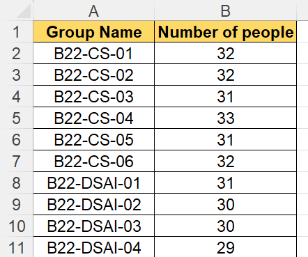
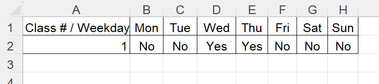

# Timetable Scheduler for Innopolis University

## Description

The IU Time Table Scheduler is an efficient tool designed to automate the scheduling process for university courses. This application accepts input files containing detailed course information, teacher preferences, and study-group requirements. It employs a sophisticated scheduling algorithm that efficiently processes the data and generates a schedule that satisfies all constraints. The resulting schedule is then conveniently formatted into a downloadable XLSX file.

## Demo

  

## How To Use

To utilize our product, follow the steps below to ensure proper usage with a completed input file in .xlsx format. The input file must adhere to the mandatory requirements outlined in this section.

### 1. Prepare the Input File:

   - Create an input file in .xlsx format.
   - Ensure that the file includes the following sheets with their respective columns and data:

     * **"Courses" Sheet**:
     
       Contains information about the courses and consists of six columns:
       * Course Name
       * Lecture/Tutorial Format (Online/Offline)
       * Course Type (Full, Block 1, or Block 2)
       * Course Year
       * Primary Instructor Name (required field)
       * Tutorial Instructor Name (can be written as "-")
       
      

        
      

     * **"Course-Groups" Sheet**:
     
       This sheet lists the study groups associated with each course and consists of two columns:
       * Course Name (must match the corresponding course name in the "Courses" sheet)
       * Study Groups (listed separated by commas)

      

        
      

     * **"TA-Course-Groups" Sheet**:
     
       This sheet provides information about Teaching Assistants (TAs) and their assigned courses. It consists of three columns:
       * TA Name
       * Course Name
       * Number of Groups the TA can take on

      

        
      

     * **"Teacher Preferences" Sheet**:
     
       This sheet captures the preferences of teachers regarding the days they can teach. It consists of eight columns:
       * Teacher* Name
       * Monday Availability (enter "yes" if available, "no" otherwise)
       * Tuesday Availability
       * Wednesday Availability
       * Thursday Availability
       * Friday Availability
       * Saturday Availability
       * Sunday Availability

      

        
      

     * **"Rooms Info" Sheet**:
     
       This sheet provides details about the available rooms and their capacities. It consists of two columns:
       * Room Number
       * Room Capacity

       

        
      

     * **"Groups Info" Sheet**:
     
       This sheet contains information about the study groups and their sizes. It consists of two columns:
       * Group Name
       * Number of People in Group

       

        
      

     * **"Sport Electives Reservations" Sheet**:
     
       This sheet allows for the reservation of specific days for sport electives. It consists of eight columns:
       * Class # / Weekday
       * Monday Reservation (enter "yes" if reserved, "no" otherwise)
       * Tuesday Reservation
       * Wednesday Reservation
       * Thursday Reservation
       * Friday Reservation
       * Saturday Reservation
       * Sunday Reservation

       

        
      

      

### 2. Fill in the Required Information:

   Populate the corresponding columns and cells within each sheet of the input file with the relevant information for courses, study groups, instructors, TAs, room capacities, group sizes, and sport electives reservations.

### 3. Save the Input File:

   Save the completed input file in **.xlsx** format, ensuring all changes are saved.

### 4. Run the IU Time Table Scheduler:

   - Open the IU Time Table Scheduler [web application](http://lithium94.pythonanywhere.com/).
   - Provide the completed input file to the application (Upload buttom on main page).
   - Execute the scheduling process.

### 5. Access the Generated Schedule:

   - Once the scheduling process is complete, the application will generate a schedule based on the provided input file.
   - The schedule will be available in a downloadable XLSX format, presenting the allocated courses, instructors, rooms, and time slots.
   - Download and open the generated schedule file to view the finalized timetable.

## Features

The IU Time Table Scheduler offers the following key features:

1. **Fast Schedule Generation:** 
The application is designed to create schedules quickly, ensuring efficient use of time for both students and administrators.

1. **Overlapping Exclusion:** 
The application ensures that there are no overlapping courses or study groups, avoiding scheduling conflicts and allowing students to attend all required classes.

1. **Teacher Preferences:** 
The application takes into account the preferences of teachers, allowing for optimized allocation of courses based on their availability and preferences.

1. **Room Capacity Consideration:** 
The application considers the capacity of rooms while scheduling courses, ensuring that the allocated rooms can accommodate the expected number of students.

1. **Reserved Days for Sports:** 
The application reserves specific days for sports activities, preventing conflicts between course schedules and sports events.

1. **Easy Manual Refinement:** 
The application provides easy manual refinement of the generated schedule. If there is something you don't like or want to change, you have the flexibility to make adjustments manually. The application displays the available audiences for each timeslot, allowing you to modify the output file effortlessly.

## Project Installation

## Technologies used

## Badges

## For Customer

You can bring up the server yourself.

Server is written in Flask, JS, HTML and CSS.

## Acknowledgments
We would like to express our gratitude to the contributors and supporters of the IU Time Table Scheduler project. Your valuable input and feedback have helped shape and improve this application. Thank you for your dedication and contributions.

Authors:
1. [Alie Ablaeva](mailto:a.ablaeva@innopolis.university)
1. [Elisei Smirnov](mailto:el.smirnov@innopolis.university)
1. [Artem Matevosian](mailto:a.matevosian@innopolis.university)
1. [Sofia Gamershmidt](mailto:s.gamershmidt@innopolis.university)
1. [Egor Lebedev](mailto:e.lebedev@innopolis.university)

## Contact
For any questions, suggestions, or issues regarding the IU Time Table Scheduler, please contact our team at [email](mailto:el.smirnov@innopolis.university). We appreciate your feedback and will respond to your inquiry as soon as possible.
